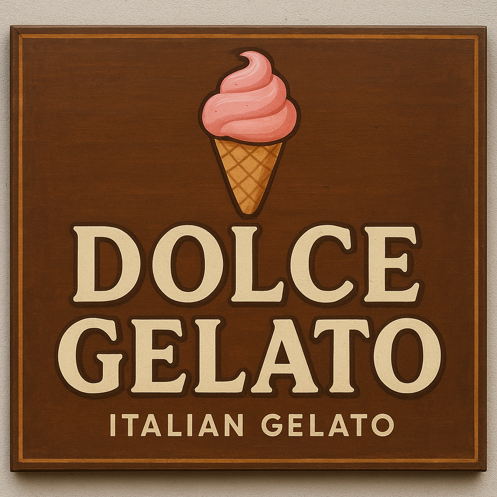

# sorveteria-

<!DOCTYPE html>
<html lang="en">
<head>
    <meta charset="UTF-8">
    <meta name="viewport" content="width=device-width, initial-scale=1.0">

    <link href="https://cdn.jsdelivr.net/npm/bootstrap@5.3.7/dist/css/bootstrap.min.css" rel="stylesheet" integrity="sha384-LN+7fdVzj6u52u30Kp6M/trliBMCMKTyK833zpbD+pXdCLuTusPj697FH4R/5mcr" crossorigin="anonymous">
    
    <link rel="stylesheet" href="dd.css" />
    <title>Document</title>
</head>
<body>

  
    <header>
      <h1>DOLCE GELATO</h1>
        <nav class="navbar navbar-expand-lg bg-body-tertiary">
            

              
              <button class="navbar-toggler" type="button" data-bs-toggle="collapse" data-bs-target="#navbarSupportedContent" aria-controls="navbarSupportedContent" aria-expanded="false" aria-label="Toggle navigation">
                
              </button>
              

                <ul class="navbar-nav me-auto mb-2 mb-lg-0">
                  <li class="nav-item">
                    <a class="nav-link active" aria-current="page" href="telainicial.html">cadastrar</a>
                  </li>
                  <li class="nav-item">
                    <a class="nav-link" href="#">cardapio</a>
                  </li>
                  <li class="nav-item dropdown">
                    <a class="nav-link dropdown-toggle" href="#" role="button" data-bs-toggle="dropdown" aria-expanded="false">
                      Dropdown
                    </a>
                    <ul class="dropdown-menu">
                      <li><a class="dropdown-item" href="#">Action</a></li>
                      <li><a class="dropdown-item" href="#">Another action</a></li>
                      <li>
</li>
                      <li><a class="dropdown-item" href="#">colaboradores</a></li>
                    </ul>
                  </li>
                  <li class="nav-item">
                    <a class="nav-link disabled" aria-disabled="true">Disabled</a>
                  </li>
                </ul>
                <form class="d-flex" role="search">
                  <input class="form-control me-2" type="search" placeholder="Procurar" aria-label="procurar"/>
                  <button class="btn btn-outline-success" type="submit">Procurar</button>
                </form>
              

            

          </nav>
        
    </header>

    
    <section id="sabores" class="py-5">
      

        <h2 class="text-center mb-5">Nossos Sabores</h2>
        

          

            

              
              

                <h5 class="card-title">Chocolate</h5>
                
Clássico e irresistível, feito com cacau premium.

              

            

          

          

            

              
              

                <h5 class="card-title">Morango</h5>
                
Refrescante e natural, com pedaços de fruta.

              

            

          

          

            

              
              

                <h5 class="card-title">Baunilha</h5>
                
Suave e cremoso, o sabor mais amado do mundo.

              

            

          

        

      

    </section>

    <section id="sabores" class="py-5">
      

        <h2 class="text-center mb-5"></h2>
        

          

            

              
              

                <h5 class="card-title">Limão</h5>
                
Azedinho e irresistível, feito com limão siciliano.

              

            

          

          

            

              
              

                <h5 class="card-title">Açaí</h5>
                
Refrescante e natural, com pedaços de fruta.

              

            

          

          

            

              
              

                <h5 class="card-title">Café</h5>
                
Suave e cremoso, o sabor mais amado do brasil.

              

            

          

        

      

    </section>

  <h1>SOBRE NÓS</h1>
      <h5>
        Localizada no coração da cidade, a Delícias Geladas é um verdadeiro paraíso para os amantes de sorvete. Com um ambiente acolhedor, colorido e cheio de charme, a sorveteria oferece uma experiência única, combinando sabores tradicionais com criações exclusivas feitas artesanalmente.
      O cardápio conta com mais de 30 opções de sorvetes, incluindo sabores clássicos como chocolate belga, morango e baunilha, além de receitas especiais como pistache italiano, cheesecake de frutas vermelhas e manga com pimenta. Há também opções veganas, sem lactose e zero açúcar.
      Além dos sorvetes servidos na casquinha ou no copinho, a Delícias Geladas oferece milk-shakes cremosos, açaís, taças decoradas, brownies com bola de sorvete e cafés gelados.
      O atendimento é sempre simpático, e o cheirinho de casquinha assando na hora é um convite irresistível para entrar e se deliciar. Perfeita para um passeio em família, uma pausa refrescante no meio do dia ou simplesmente para adoçar a vida.
    </h5>

    <section id="contato" class="py-5">
      

        <h2 class="text-center mb-4">Fale Conosco</h2>
        <form class="col-md-6 mx-auto">
          

            <label for="nome" class="form-label">Nome</label>
            <input type="text" class="form-control" id="nome" placeholder="Digite seu nome">
          

          

            <label for="email" class="form-label">E-mail</label>
            <input type="email" class="form-control" id="email" placeholder="Digite seu e-mail">
          

          

            <label for="mensagem" class="form-label">Mensagem</label>
            <textarea class="form-control" id="mensagem" rows="4" placeholder="Escreva sua mensagem"></textarea>
          

          <button type="submit" class="btn btn-primary w-100">Enviar</button>
        </form>
      

    </section>
  

  

</body>
</html>
